# evtec-integra
Documenting a 1996 JDM Honda Integra DB6 Sedan EV Restomod

## Subsystem diagrams

### CAN bus

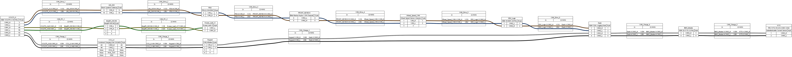

### HVIL bus

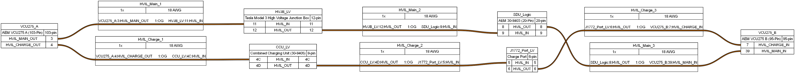

### Master 12V

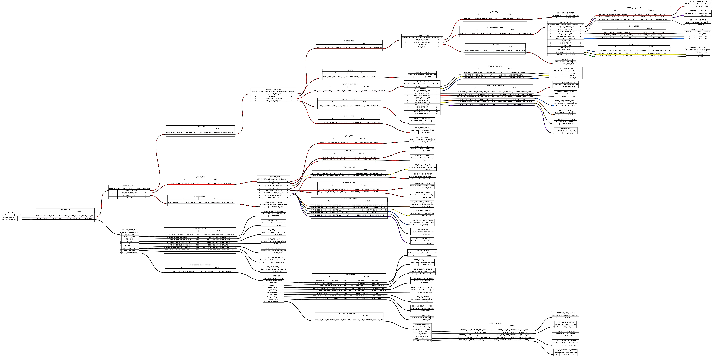

### Master HV

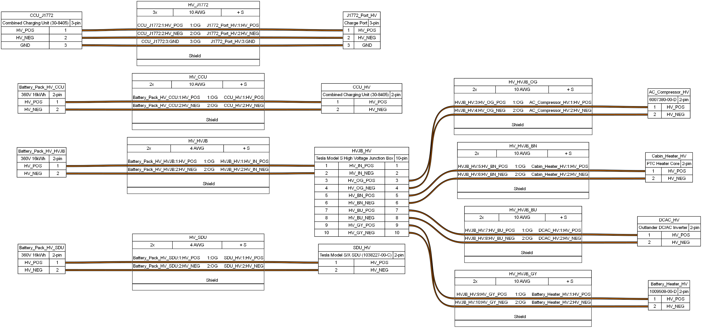

## Component diagrams

### AEM CCU

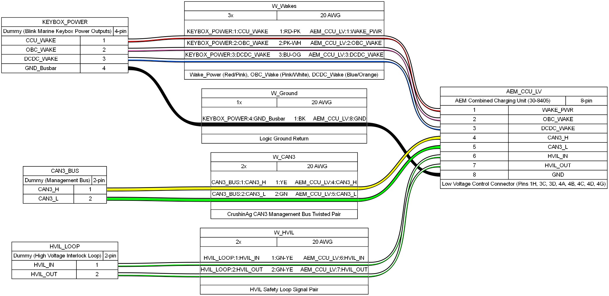

### AEM VCU driver controls

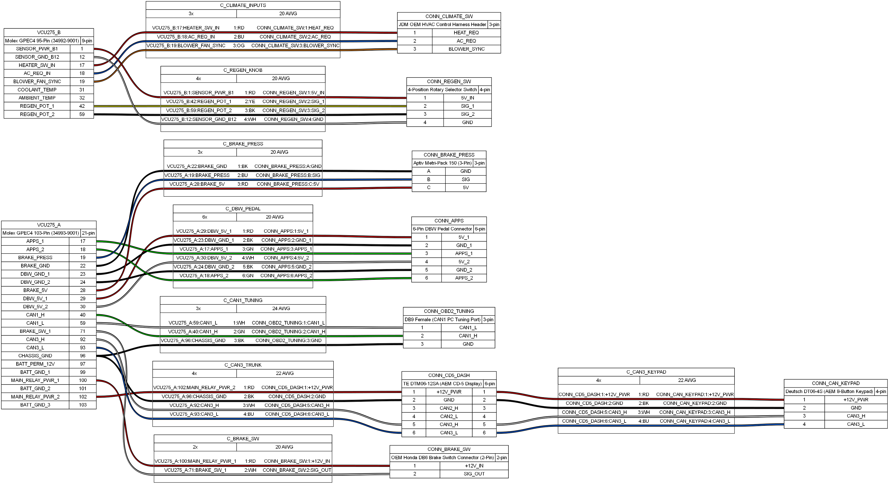

### Brake pressure switch

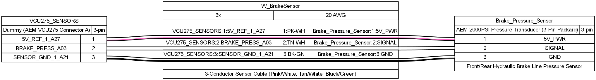

### CAN keypad

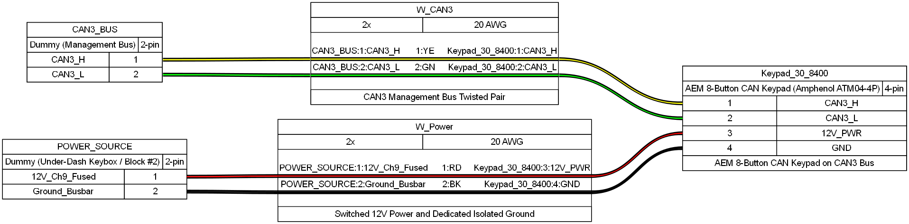

### CR-V iBooster

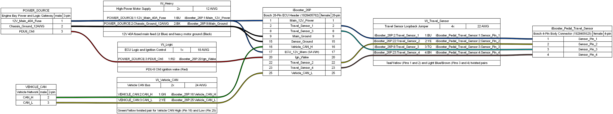

### DBW pedal

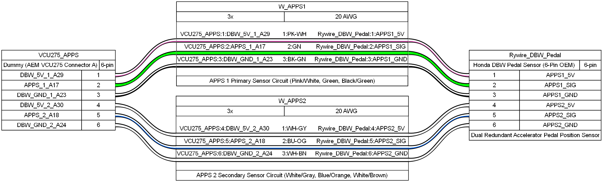

### Front keybox

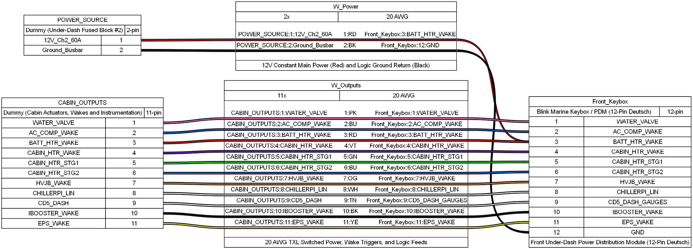

### IVS sensor

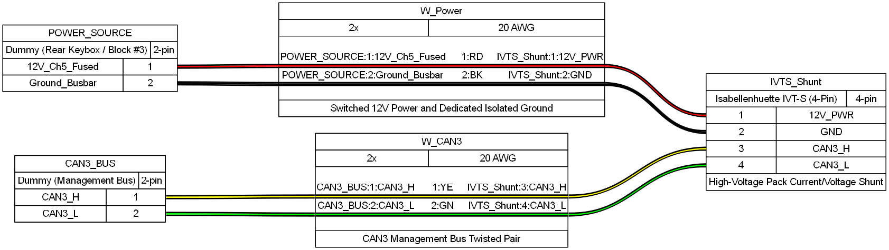

### Pacifica battery

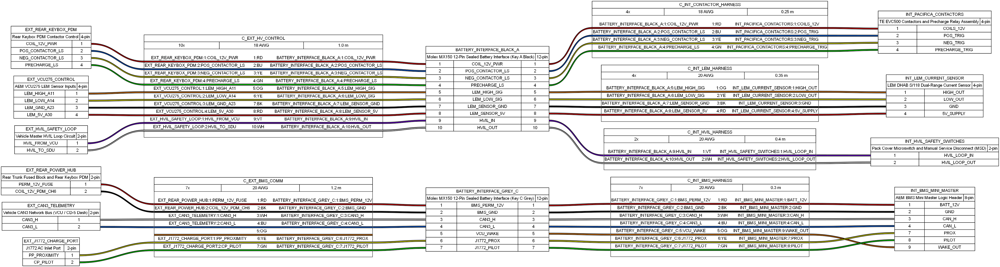

### Rear keybox

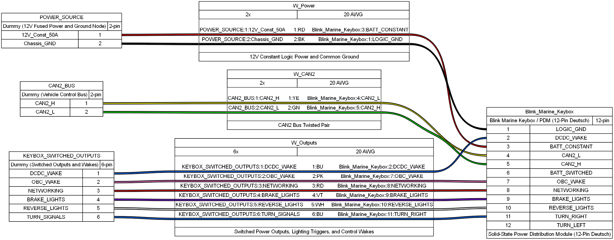

### Tesla Superbottle v1 (RPi)

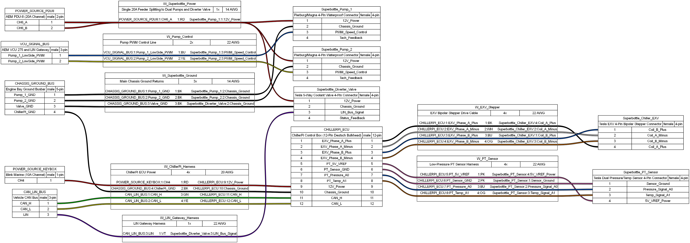

### Tesla Superbottle v2 (ESP32)

